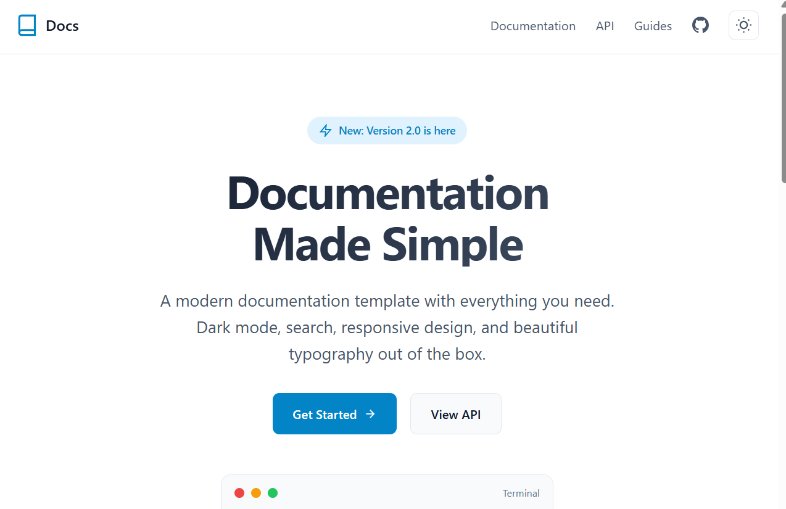
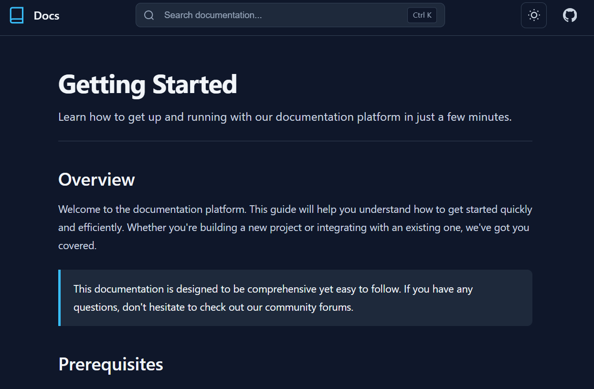

# Documentation Template

A modern, professional documentation template with dark mode, search, and responsive design.

**Powered by [DZBuild](https://dzbuild.com)**

## Preview

### Light Mode


### Dark Mode


## Features

- Clean, modern design with dark/light mode
- Responsive sidebar navigation
- Table of contents for each page
- Keyboard shortcuts (Ctrl+K for search)
- Mobile-friendly layout
- Fast static site generation

## Quick Start

### 1. Clone the Repository

```bash
git clone https://github.com/youcefzemmar/Documentation-Site.git
cd Documentation-Site
```

### 2. Install Dependencies

```bash
npm install
```

### 3. Start Development Server

```bash
npm run dev
```

Your site will be running at `http://localhost:4321`

## Project Structure

```
/
├── public/
│   └── favicon.svg
├── src/
│   ├── components/
│   │   ├── Header.astro      # Top navigation bar
│   │   ├── Sidebar.astro     # Side navigation menu
│   │   └── TableOfContents.astro
│   ├── layouts/
│   │   ├── Layout.astro      # Base layout
│   │   └── DocsLayout.astro  # Documentation pages layout
│   ├── pages/
│   │   ├── index.astro       # Landing page
│   │   └── docs/             # Documentation pages
│   │       ├── getting-started.astro
│   │       ├── installation.astro
│   │       └── ...
│   └── styles/
│       └── global.css        # Global styles & theme
└── package.json
```

## Creating New Documentation Pages

### Step 1: Create a New Page

Create a new `.astro` file in `src/pages/docs/`:

```astro
---
import DocsLayout from '../../layouts/DocsLayout.astro';

const headings = [
  { depth: 2, slug: 'section-1', text: 'Section 1' },
  { depth: 2, slug: 'section-2', text: 'Section 2' },
];
---

<DocsLayout
  title="Your Page Title"
  description="Brief description of this page"
  headings={headings}
>
  <h2 id="section-1">Section 1</h2>
  <p>Your content here...</p>

  <h2 id="section-2">Section 2</h2>
  <p>More content...</p>
</DocsLayout>
```

### Step 2: Add to Navigation

Edit `src/components/Sidebar.astro` to add your new page to the navigation:

```javascript
const navigation = [
  {
    title: "Getting Started",
    items: [
      { title: "Introduction", href: "/docs/getting-started" },
      { title: "Your New Page", href: "/docs/your-new-page" }, // Add this
    ]
  },
  // ...
];
```

## Customization

### Changing Colors

Edit `src/styles/global.css` to modify the color scheme:

```css
:root {
  --color-primary: #0284c7;        /* Main brand color */
  --color-primary-hover: #0369a1;  /* Hover state */
  --color-bg: #ffffff;             /* Background */
  --color-text: #0f172a;           /* Text color */
  /* ... */
}
```

### Changing the Logo

Edit `src/components/Header.astro` and `src/pages/index.astro` to replace the SVG logo with your own.

### Updating Site Title

Edit the `title` prop in `src/components/Header.astro`:

```astro
<Header title="Your Docs Title" />
```

## Building for Production

```bash
npm run build
```

This creates a `dist/` folder with your static site.

## Hosting Options

### Vercel (Recommended)

1. Push your code to GitHub
2. Go to [vercel.com](https://vercel.com)
3. Import your repository
4. Deploy automatically

### Netlify

1. Push your code to GitHub
2. Go to [netlify.com](https://netlify.com)
3. Connect your repository
4. Set build command: `npm run build`
5. Set publish directory: `dist`

### Cloudflare Pages

1. Push your code to GitHub
2. Go to [pages.cloudflare.com](https://pages.cloudflare.com)
3. Connect your repository
4. Configure build settings:
   - Build command: `npm run build`
   - Output directory: `dist`

### GitHub Pages

1. Install the GitHub Pages adapter:
   ```bash
   npm install @astrojs/github-pages
   ```

2. Update `astro.config.mjs`:
   ```javascript
   import { defineConfig } from 'astro/config';

   export default defineConfig({
     site: 'https://yourusername.github.io',
     base: '/Documentation-Site',
   });
   ```

3. Create `.github/workflows/deploy.yml` for automatic deployment

### Self-Hosted

Upload the contents of the `dist/` folder to any static web server (Nginx, Apache, etc.).

## Commands Reference

| Command           | Description                              |
|-------------------|------------------------------------------|
| `npm install`     | Install dependencies                     |
| `npm run dev`     | Start development server                 |
| `npm run build`   | Build for production                     |
| `npm run preview` | Preview production build locally         |

## Support

- GitHub: [github.com/youcefzemmar/Documentation-Site](https://github.com/youcefzemmar/Documentation-Site)
- Website: [dzbuild.com](https://dzbuild.com)

## License

MIT License - Feel free to use this template for your projects.

---

**Powered by [DZBuild](https://dzbuild.com)**
